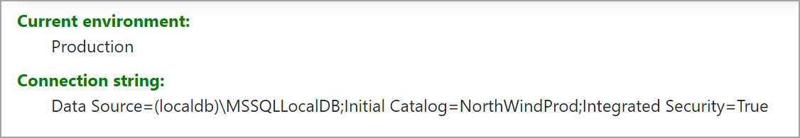

# Working with environments

In Program.cs the environment is set (for demo purposes only)

```csharp
var builder = WebApplication.CreateBuilder(new WebApplicationOptions
{
    EnvironmentName = Environments.Production
});
```

Model for reading connection string

```csharp
public class ApplicationSettings
{
    public const string Key = "ConnectionStrings";
    public string? NorthWindConnection { get; set; }
}
```

Index page code behind

```csharp
public class IndexModel : PageModel
{
    private readonly IOptionsSnapshot<ApplicationSettings> _applicationSettings;

    [BindProperty]
    public string ConnectionString { get; set; }
    public IndexModel(IOptionsSnapshot<ApplicationSettings> applicationSettings)
    {
        _applicationSettings = applicationSettings;
        ConnectionString = _applicationSettings.Value.NorthWindConnection!;
    }
}
```

Index page front end

```html
@page
@inject IWebHostEnvironment Env
@model IndexModel
@{
    ViewData["Title"] = "Home page";
}

<div class="mt-2">
    <dl>
        <dt>Current environment</dt>
        <dd>@Env.EnvironmentName</dd>
        <dt>Connection string</dt>
        <dd>@Model.ConnectionString</dd>
    </dl>
</div>
```

